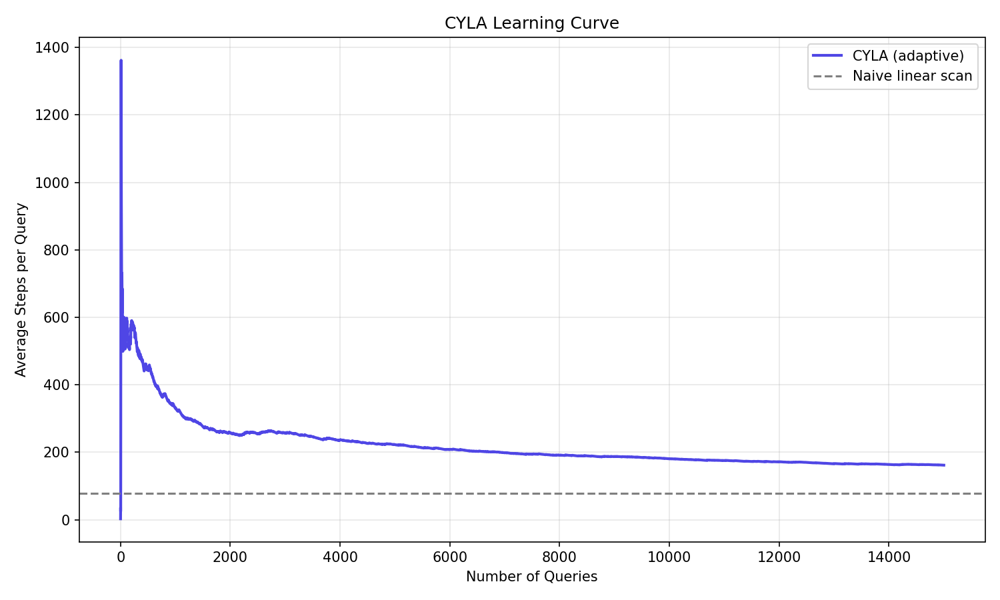

<div align="center">
  
  <br><br>
  <h1>CYLA</h1>
  <p><strong>Self-Organizing Adaptive List</strong></p>
</div>

<hr width="60%" align="center">

A minimal research prototype that shows a plain Python list can learn access patterns online and reduce average search cost on skewed workloads — no frameworks, no training data.

## Quick Start

```bash
git clone https://github.com/Elitsuv/cyla.git
cd cyla

pip install requirement.txt

python example.py          
python test.py

**Benchmark** (N=5,000 items, 15,000 queries, Zipf α=1.5)  
Final result: **Naive: 80.2 steps/query** → **CYLA: 166.5 steps/query** → **Gain: -107.7%**  


| Queries    | Naive Avg Steps | CYLA Avg Steps | Gain     |
|------------|-----------------|----------------|----------|
| 1,500      | 801.8           | 310.1          | +61.3%   |
| 3,000      | 400.9           | 253.8          | +36.7%   |
| 4,500      | 267.3           | 216.4          | +19.1%   |
| 6,000      | 200.5           | 202.7          | -1.1%    |
| 7,500      | 160.4           | 190.8          | -19.0%   |
| 9,000      | 133.6           | 185.3          | -38.7%   |
| 10,500     | 114.5           | 180.8          | -57.8%   |
| 12,000     | 100.2           | 173.8          | -73.4%   |
| 13,500     | 89.1            | 171.6          | -92.6%   |
| 15,000     | 80.2            | 166.5          | -107.7%  |

**Learning Curve** (steps vs queries):

