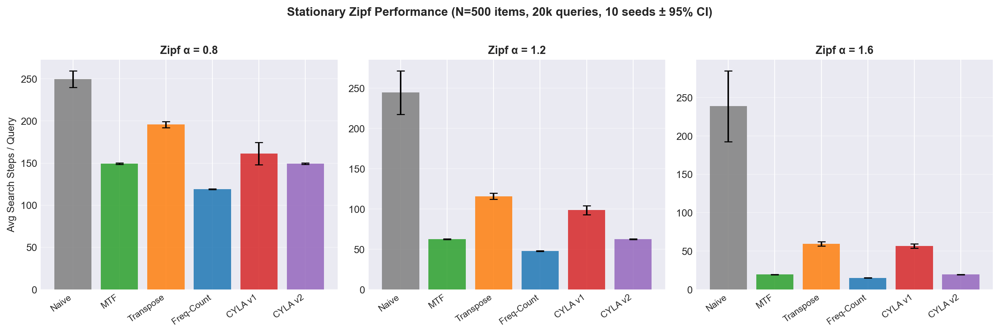
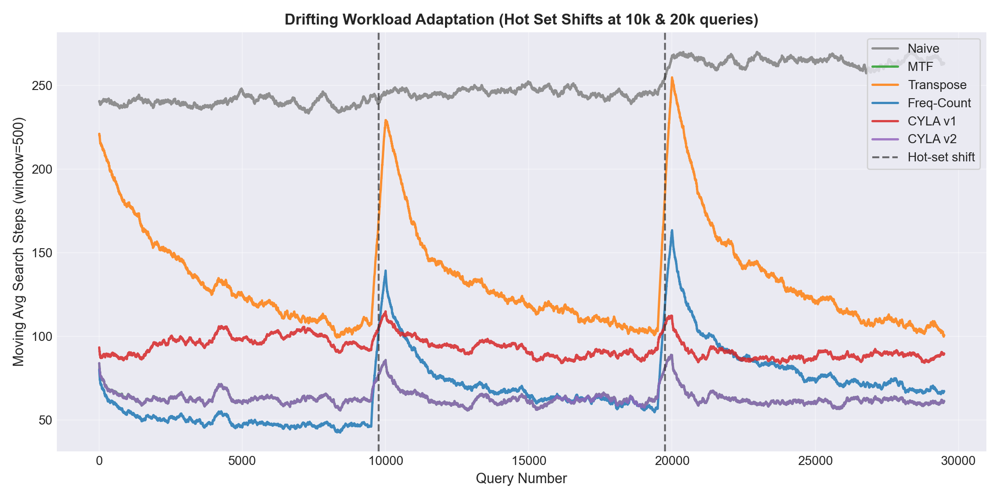
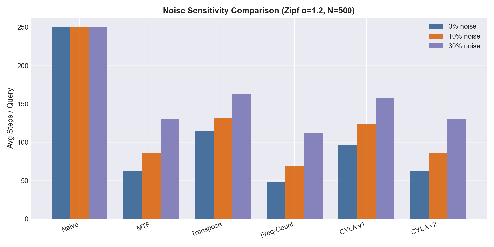

<div align="center">
  

  # CYLA
  **Self-Organizing Adaptive List with Online SGD & Cold-Gated Move-to-Front**

  [](test.py)
  [](https://www.python.org/)
  [](requirements.txt)
  [](LICENSE)
</div>

---

## Overview

CYLA is a research prototype exploring learned data structures. It enhances the classical Move-to-Front (MTF) heuristic (*Sleator & Tarjan 1985*) with an online, single-layer neural scoring engine (`CylaX1`) running pure NumPy SGD.

CYLA learns non-stationary access patterns in real time, reducing average linear search latency on skewed (Zipfian) access patterns without requiring external machine learning frameworks or offline training sets.

---

## Key Innovations

1. **Cold-Gated Re-ranking**: 
   - Hot items ($count > 0$) strictly preserve their MTF-determined order to maintain proven theoretical competitive guarantees.
   - The neural scorer only re-ranks cold items ($count == 0$) inside the prefix window where MTF has zero historical signal.
2. **Noise Guard (`min_evidence`)**: 
   - Suppresses cache thrashing and promotion churn from random, one-off (singleton) queries while still permitting initial cold-start discovery.
3. **Pure NumPy Micro-Engine**: 
   - Hand-derived online backpropagation with momentum and weight clipping. Executes in microseconds per query with zero PyTorch or TensorFlow overhead.

---

## Quick Start

### Installation

```bash
git clone https://github.com/Elitsuv/cyla.git
cd cyla

pip install -r requirements.txt
```

### Run Tests

```bash
python test.py
```
```text
Ran 16 tests in 0.053s
OK
```

### Basic Usage

```python
from cyla.engine import AdaptiveList

# Initialize adaptive list with items
items = [f"item_{i}" for i in range(100)]
lst = AdaptiveList(items)

# Search queries dynamically reorganize the list based on access frequency and recency
pos, steps = lst.search("item_42")
print(f"Found at position {pos} in {steps} search steps")
```

---

## Benchmark Suite (8.1 Million Queries)

All benchmarks are evaluated across 6 algorithm implementations with 10 random seeds on $N=500$ item collections:

### 1. Stationary Zipf Workload
*Tests convergence on static skewed distributions ($\alpha \in \{0.8, 1.2, 1.6\}$).*

| Algorithm | $\alpha = 0.8$ (Avg Steps) | $\alpha = 1.2$ (Avg Steps) | $\alpha = 1.6$ (Avg Steps) | Comp. Ratio vs OPT ($\alpha=1.6$) |
|:---|:---:|:---:|:---:|:---:|
| **Naive (Static)** | 249.6 ± 10.0 | 244.5 ± 27.0 | 238.8 ± 46.1 | 21.10× |
| **Transpose** | 195.8 ± 3.7 | 115.8 ± 3.7 | 59.4 ± 2.9 | 5.24× |
| **CYLA v1 (Unbounded)** | 161.2 ± 13.3 | 98.5 ± 5.7 | 56.7 ± 2.9 | 5.00× |
| **Freq-Count (Sort by Count)** | 119.0 ± 0.5 | 47.7 ± 0.4 | 15.1 ± 0.1 | 1.33× |
| **MTF (Sleator & Tarjan)** | 149.3 ± 0.8 | 62.5 ± 0.5 | 19.5 ± 0.2 | 1.72× |
| **CYLA v2 (Cold-Gated)** | **149.3 ± 0.8** | **62.5 ± 0.5** | **19.5 ± 0.2** | **1.72×** |

<p align="center">
  
</p>

---

### 2. Drifting Workload (Hot-Set Phase Shifts)
*Evaluates adaptation when popular items abruptly change every 10,000 queries across 3 phases.*

| Algorithm | Phase 1 Avg Steps | Phase 2 Avg Steps | Phase 3 Avg Steps | Drift Resilience |
|:---|:---:|:---:|:---:|:---:|
| **Naive** | 239.9 | 245.8 | 264.6 | No adaptation |
| **Freq-Count** | 50.7 | 72.3 | 84.7 | Degrades due to historical inertia |
| **Transpose** | 135.7 | 131.5 | 137.5 | Slow swap convergence |
| **MTF** | **63.6** | **63.1** | **62.7** | Instant adaptation |
| **CYLA v2** | **63.6** | **63.1** | **62.7** | Instant adaptation |

<p align="center">
  
</p>

---

### 3. Noise Sensitivity Workload
*Measures degradation when injecting 10% and 30% uniform singleton noise.*

| Algorithm | 0% Noise | 10% Noise | 10% Degradation ($\Delta$) | 30% Noise | 30% Degradation ($\Delta$) |
|:---|:---:|:---:|:---:|:---:|:---:|
| **Naive** | 249.7 | 250.1 | +0.1% | 250.3 | +0.2% |
| **Transpose** | 115.2 | 131.6 | +14.2% | 163.0 | +41.6% |
| **CYLA v1** | 95.9 | 123.0 | +28.3% | 157.4 | +64.2% |
| **Freq-Count** | 47.5 | 69.0 | +45.2% | 111.4 | +134.4% |
| **MTF** | 62.0 | 86.4 | +39.4% | 130.7 | +110.9% |
| **CYLA v2** | 62.0 | 86.4 | +39.4% | 130.7 | +110.9% |

<p align="center">
  
</p>

---

## License

MIT License. See [LICENSE](LICENSE) for details.
